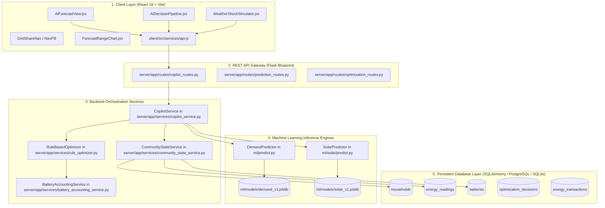

# GridShare AI — Technical Architecture & Runtime Trace

This document details the exact technical architecture, service dependency graph, execution sequence, data schemas, and API contracts for the GridShare AI and Hornet AI orchestration layer.

---

## 1. System Architecture & Component Dependency Graph



---

## 2. End-to-End Runtime Execution Trace

When a user opens the Hornet AI Hub or requests `GET /api/copilot/insights?horizon_minutes=15`, the system follows this exact sequence:

```
[Browser Client]
       │
       ▼ (1) GET /api/copilot/insights?horizon_minutes=15
[copilot_routes.get_copilot_insights()]
       │
       ▼ (2) CopilotService.get_copilot_insights()
       │
       ├──► (3) CommunityStateService.observe_community_state()
       │          └─ Gathers latest EnergyReading & Battery SOC across households.
       │
       ├──► (4) DemandPredictor.predict_demand(history, horizon_minutes=15)
       │          └─ Builds 32-feature vector -> executes demand_v1.joblib (150 trees)
       │          └─ Returns: predicted_consumption_kw (e.g. 4.21 kW)
       │
       ├──► (5) SolarPredictor.predict_solar(history, horizon_minutes=15)
       │          └─ Builds 27-feature vector -> executes solar_v1.joblib (150 trees)
       │          └─ Computes tree ensemble spread (tree_std)
       │          └─ Returns: predicted_ghi, lower_ghi, upper_ghi (e.g. 808–1056 W/m²)
       │
       ├──► (6) Explicit PV Conversion Layer:
       │          └─ solar_kw = (predicted_ghi / 1000) * 4.0 * 0.18 * 0.86
       │          └─ solar_lower_kw = (lower_ghi / 1000) * 4.0 * 0.18 * 0.86
       │          └─ solar_upper_kw = (upper_ghi / 1000) * 4.0 * 0.18 * 0.86
       │
       ├──► (7) Net Energy Balance Calculation:
       │          └─ predicted_balance_kw = solar_kw - demand_kw
       │          └─ conservative_balance_kw = solar_lower_kw - demand_kw
       │
       ├──► (8) RuleBasedOptimizer.allocate_energy(...)
       │          └─ Priority 1: LOCAL_TRADE
       │          └─ Priority 2: STORE (Battery headroom)
       │          └─ Priority 3: GRID_EXPORT
       │          └─ Priority 4: DISCHARGE (if balance < 0 and SOC >= 20%)
       │          └─ Priority 5: GRID_IMPORT (if balance < 0 and SOC < 20%)
       │
       ├──► (9) Explainable Reasoning & Impact Synthesis:
       │          └─ Generates dynamic text bullets from real telemetry numbers
       │          └─ Calculates rupee savings: amount_kwh * (grid_price - p2p_price)
       │          └─ Calculates CO2 avoided: amount_kwh * 0.82 kg CO2/kWh
       │
       ▼ (10) Return JSON HTTP 200 Response
[AiForecastView / AiDecisionPipeline]
       └─ Renders 6-Step Visual Progression Cards, Decision Hero, and Corridor Chart.
```

---

## 3. Code Specifications by Subsystem

### A. Machine Learning Engines (`ml/`)

#### 1. Demand Model (`demand_v1`)
- **Source File**: `ml/predict.py` (`class DemandPredictor`)
- **Artifact**: `ml/models/demand_v1.joblib` (130.6 MB)
- **Features (32)**:
  `hour`, `minute`, `day_of_week`, `day_of_month`, `month`, `is_weekend`, `sin_hour`, `cos_hour`, `sin_day_of_week`, `cos_day_of_week`, `sin_month`, `cos_month`, `lag_15m`, `lag_30m`, `lag_45m`, `lag_1h`, `lag_2h`, `lag_3h`, `lag_6h`, `lag_12h`, `lag_24h`, `rolling_mean_1h`, `rolling_mean_3h`, `rolling_std_1h`, `rolling_mean_6h`, `rolling_mean_24h`, `lag_15m_reactive_power`, `lag_15m_voltage`, `lag_15m_intensity`, `lag_15m_sub1`, `lag_15m_sub2`, `lag_15m_sub3`.
- **Top Predictive Feature**: `lag_15m` (78.48% feature importance).
- **Inference Method**: `predict_demand(recent_history, horizon_minutes, current_time)`.

#### 2. Solar Resource Model (`solar_v1`)
- **Source File**: `ml/solar/predict.py` (`class SolarPredictor`)
- **Artifact**: `ml/models/solar_v1.joblib` (32.9 MB)
- **Features (27)**:
  `hour`, `minute`, `day_of_year`, `month`, `is_weekend`, `sin_hour`, `cos_hour`, `sin_day_of_year`, `cos_day_of_year`, `solar_elevation_proxy`, `lag_15m_ghi`, `lag_30m_ghi`, `lag_45m_ghi`, `lag_1h_ghi`, `lag_2h_ghi`, `lag_3h_ghi`, `lag_6h_ghi`, `lag_24h_ghi`, `lag_15m_dni`, `lag_15m_dhi`, `lag_15m_temp`, `lag_15m_humidity`, `lag_15m_wind`, `rolling_mean_1h_ghi`, `rolling_mean_3h_ghi`, `rolling_std_1h_ghi`, `rolling_mean_6h_ghi`.
- **Top Predictive Feature**: `lag_15m_ghi` (96.76% feature importance).
- **Uncertainty Method**: Calculates the standard deviation across all 150 individual decision trees in the ensemble ($\sigma_{\text{trees}}$) and constructs the prediction corridor:
  $$\text{lower\_ghi} = \max\left(0, \text{predicted\_ghi} - 1.96 \cdot \sigma_{\text{trees}}\right)$$
  $$\text{upper\_ghi} = \text{predicted\_ghi} + 1.96 \cdot \sigma_{\text{trees}}$$

---

### B. Energy Routing Engine (`RuleBasedOptimizer`)

- **Source File**: `server/app/services/rule_optimizer.py`
- **Method**: `allocate_energy(surplus_kw, deficit_kw, battery_soc, battery_capacity_kwh, battery_min_reserve, grid_price, p2p_price, max_charge_rate_kw)`
- **Core Parameters**:
  - `battery_min_reserve`: $20.0\%$ ($10.0\text{ kWh}$ on a $50\text{ kWh}$ system).
  - `grid_price`: ₹6.10 / kWh (base utility tariff).
  - `p2p_price`: ₹4.50 / kWh (peer-to-peer clearing rate).
  - `max_charge_rate_kw`: $15.0\text{ kW}$ (physical inverter limit).

---

### C. REST API Contract (`GET /api/copilot/insights`)

**Request**:
```http
GET /api/copilot/insights?horizon_minutes=15&household_id=house_a HTTP/1.1
Host: 127.0.0.1:5000
```

**Response Schema**:
```json
{
  "status": "SUCCESS",
  "data": {
    "timestamp": "2026-08-28T12:30:00Z",
    "horizon_minutes": 15,
    "household_id": "house_a",
    "models_used": {
      "demand": "demand_v1",
      "solar": "solar_v1",
      "optimizer": "rule_engine_v1.0"
    },
    "current_state": {
      "generation_kw": 6.8,
      "demand_kw": 2.1,
      "net_balance_kw": 4.7,
      "battery_soc": 40.0,
      "grid_tariff_rs": 6.10,
      "p2p_market_price_rs": 4.50
    },
    "forecast": {
      "solar_kw": 5.84,
      "solar_lower_kw": 5.31,
      "solar_upper_kw": 6.28,
      "predicted_ghi": 932.6,
      "lower_ghi": 848.0,
      "upper_ghi": 1002.5,
      "demand_kw": 4.21,
      "balance_kw": 1.63,
      "conservative_balance_kw": 1.10
    },
    "decision": {
      "action": "LOCAL_TRADE",
      "action_label": "TRADE 1.0 kWh LOCALLY",
      "amount_kwh": 1.0,
      "status": "RECOMMENDED",
      "workflow_state": "PENDING_REVIEW",
      "target_entity": "LOCAL_TRADE"
    },
    "risk_check": {
      "expected_surplus_kw": 1.63,
      "conservative_surplus_kw": 1.10,
      "energy_offered_kwh": 1.0,
      "forecast_range_solar_kw": [5.31, 6.28],
      "forecast_range_ghi_w_m2": [848.0, 1002.5],
      "solar_variability_std_w_m2": 39.4,
      "cloud_volatility_risk": "LOW",
      "battery_reserve_protected": true,
      "safety_margin_preserved": true
    },
    "reasoning": [
      "Predicted community surplus is +1.63 kW (+1.10 kW conservative lower bound).",
      "Local peer deficit of 2.80 kW is actively requesting energy at House B.",
      "Community battery reserve is healthy at 40.0% (exceeds 20.0% safety floor).",
      "Local P2P rate of Rs 4.50/kWh provides Rs 1.60/kWh peer savings vs grid tariff Rs 6.10/kWh."
    ],
    "impact": {
      "estimated_saving_rs": 1.60,
      "grid_energy_avoided_kwh": 1.0,
      "local_energy_used_kwh": 1.0,
      "co2_avoided_kg": 0.82
    }
  }
}
```
